# Research Tree — climb cycle observability

> Generated by `tools/climb/regen-tree.py` (deterministic — 43 runs logged)
> Do NOT edit — re-generated on every push / LB landed / cycle complete.

**SOTA**: P5-R4+omni7b005-20260606 = 0.75 (paradigm omni-lora-softadd)

## In-flight / session state (dynamic — resume reads this, then verifies liveness)

- **phase**: D-30 dual-model R4 全栈证伪 → 复赛镜像锁 S5 单 baseline ctx. S5=0.747131 合规 SOTA, 公榜 #3, 距 #1 +0.0076. 剩 9 天 × 5 = 45 push 配额. 战略: 复赛准备最优 + 公榜信息收集.
- **best online**: 0.747569
- **last_cycle**: 40
- **next_hypothesis**: ?

**In-flight job** (resume MUST verify liveness):
- task: Cycle 25: Cross-context S5 probe (cross-ctx degradation on real LB)
- next_action: build S5 truncated variants keep=125/63 + push 2

## Paradigm calibration matrix

| paradigm | n | mean_gap | std | last_3 |
|---|---|---|---|---|
| context-only | 5 | 0.07 | 0.01 | [0.09, 0.07, 0.04] |
| cloud-whisper-large-v3-vap | 3 | 0.00 | 0.01 | [-0.01, 0.02, -0.01] |
| baseline-enhanced | 0 | — | — | [—] |
| vap-stereo | 0 | — | — | [—] |
| vap-cpc-stereo | 1 | -0.01 | — | [-0.01] |
| ensemble | 0 | — | — | [—] |
| unknown | 0 | — | — | [—] |
| ti-text-fusion | 0 | — | — | [—] |
| context-whisper-orthofuse | 1 | 0.07 | — | [0.07] |
| ensemble-grid | 1 | 0.06 | — | [0.06] |
| context-whisper-hubert-orthofuse | 0 | — | — | [—] |

## Push ladder (chronological)

| run_id | paradigm | parent | local | online | gap | verdict |
|---|---|---|---|---|---|---|
| 20260527-1636-h001-context-only | context-only | baseline | 0.59 | 0.71 | 0.12 | 🥇 confirmed SOTA |
| 20260527-1706-h001b-context-v2 | context-only | 20260527-1636-h001-context-only | 0.59 | 0.68 | 0.09 | 🔴 falsified -0.027 激进阈值 |
| variant-B-20260528-0419 | context-only | 20260527-1636-h001-context-only | 0.65 | 0.69 | -0.04 | 🔴 falsified -0.018 切片阈值砸NA(阈值铁律3验) |
| variant-C-20260528-0424 | context-only | 20260527-1636-h001-context-only | 0.63 | 0.64 | -0.01 | 🔴 falsified -0.070 rank伤稀有类BC崩 |
| variant-F-20260528-0559 | context-only | 20260527-1636-h001-context-only | 0.64 | 0.71 | 0.07 | 🥇 confirmed NEW SOTA +0.0016 |
| cloud-whisper-smoke | cloud-whisper-large-v3-vap | baseline | 0.64 | 0.63 | -0.01 | 🥇 falsified 全线低于SOTA |
| cloud-whisper-full-cycle1 | cloud-whisper-large-v3-vap | cloud-whisper-smoke | 0.65 | 0.67 | 0.02 | 🥇 falsified 低于SOTA0.041 |
| cloud-whisper-full-balanced | cloud-whisper-large-v3-vap | cloud-whisper-full-cycle1 | 0.65 | 0.64 | -0.01 | 🥇 falsified 低于SOTA0.069 |
| vap-full | vap-cpc-stereo | baseline | 0.64 | 0.63 | -0.01 | 🔴 falsified -0.0787 vs best |
| ti-robust | ti-text-fusion | variant-F-20260528-0559 | 0.64 | 0.64 | 0.00 | 🥇 falsified CV虚高不泛化(gap+0.003 vs SOTA+0.072) |
| vap-v2-full | vap-cpc-stereo-attnpool | vap-full | 0.61 | — | — | 🔴 falsified BC0.08<mean-pool0.222(pool非瓶颈) |
| stack-fusion-grid-20260531-0129 | ensemble-grid | variant-F-20260528-0559 | 0.62 | 0.68 | 0.06 | 🔴 falsified -0.0333 nested证过拟合应验BC蒸发 |
| stack-fusion-grid-20260531-0129 | ensemble-grid | variant-F-20260528-0559 | 0.62 | 0.68 | 0.06 | 🔴 falsified -0.0333 nested证过拟合应验BC蒸发 |
| orthofuse-20260531-0319 | context-whisper-orthofuse | variant-F-20260528-0559 | 0.64 | 0.72 | 0.07 | 🥇 confirmed NEW SOTA +0.0029 跨源融合成立 |
| orthofuse-20260531-0319 | context-whisper-orthofuse | variant-F-20260528-0559 | 0.64 | 0.72 | 0.07 | 🥇 confirmed NEW SOTA +0.0029 跨源融合成立 |
| orthofuse-3src-20260601-1607 | context-whisper-hubert-orthofuse | orthofuse-20260531-0319 | 0.65 | 0.72 | 0.06 | 🥇 confirmed NEW SOTA +0.0023 hubert_bcaug 进 strat |
| orthofuse-4src+qwen3-20260601-1620 | context-whisper-hubert-qwen3 | orthofuse-3src-20260601-1607 | 0.65 | 0.71 | 0.06 | 🔴 falsified -0.003 等权 4src 反挫 D-15 |
| orthofuse-4src+e2v-20260601-1923 | context-whisper-hubert-e2v | orthofuse-3src-20260601-1607 | 0.65 | 0.71 | 0.06 | 🔴 falsified -0.003 同 qwen3 反挫 D-17 |
| orthofuse-4src+wsb-20260601-1957 | context-whisper-hubert-wsb | orthofuse-3src-20260601-1607 | 0.65 | 0.72 | 0.06 | 🔴 falsified -0.001 noise floor 内 D-17 |
| orthofuse-w2v2low-20260601-2030 | context-whisper-hubert-w2v2 | orthofuse-3src-20260601-1607 | 0.67 | 0.67 | 0.00 | 🔴 falsified -0.048 激进阈值 cherry-pick D-18 |
| probe-5push-cand1-omni050-20260602-1412 | omni-lora-softadd | orthofuse-3src-20260601-1607 | — | 0.69 | — | 🔴 falsified -0.027 过载 D-22 |
| probe-5push-cand2-omni020-20260602-1412 | omni-lora-softadd | orthofuse-3src-20260601-1607 | — | 0.73 | — | 🥇 confirmed NEW SOTA +0.011 9.4B 超 8B 待 Omni-3B 验证 |
| probe-5push-cand3-w2v2TI-20260602-1412 | context-whisper-hubert-w2v2 | orthofuse-3src-20260601-1607 | — | 0.71 | — | 🔴 falsified -0.003 D-22 |
| probe-5push-cand4-omni-20260602-1412 | omni-lora | baseline | 0.56 | 0.61 | 0.05 | 🔴 falsified -0.105 mean-pool 稀疏事件失败 D-20 |
| probe-5push-cand5-4bcaug-20260602-1412 | multi-head-eq | baseline | — | 0.61 | — | 🔴 falsified -0.110 BC=1 全归零 D-22 |
| R5-NSOTA07-20260604 | softadd-multi-ssl | orthofuse-3src-20260601-1607 | — | 0.74 | PUSH | 🟡 0 |
| R6-NSOTA07+e2v003-20260605 | softadd-multi-ssl | R5-NSOTA07-20260604 | — | 0.74 | PUSH | 🟡 0 |
| R4-NSOTA07+e2v003+hub003-20260605 | softadd-multi-ssl | R5-NSOTA07-20260604 | — | 0.75 | PUSH | 🟡 0 |
| S1-R4+w2v2ms003-20260605 | softadd-multi-ssl | R4-NSOTA07+e2v003+hub003-20260605 | — | 0.74 | PUSH | 🟡 0 |
| S2-R4+e2v004+hub004-20260605 | softadd-multi-ssl | R4-NSOTA07+e2v003+hub003-20260605 | — | 0.74 | PUSH | 🟡 0 |
| S5-R4+omni3b005-20260605 | omni-lora-softadd | R4-NSOTA07+e2v003+hub003-20260605 | — | 0.75 | PUSH | 🟡 2 |
| P1-S5+wsp010-20260606 | omni-lora-softadd | S5-R4+omni3b005-20260605 | — | 0.74 | PUSH | 🟡 0 |
| P5-R4+omni7b005-20260606 | omni-lora-softadd | R4-NSOTA07+e2v003+hub003-20260605 | — | 0.75 | PUSH | 🟡 2 |
| M2-R4-mask050-10s-20260606 | context-only | R4-NSOTA07+e2v003+hub003-20260605 | — | 0.74 | PUSH | 🟡 0.1 |
| A-S5+omni7b003-20260607 | omni-lora-softadd | S5-R4+omni3b005-20260605 | — | 0.75 | PUSH | 🟡 0 |
| B-S5+qwen17b003-20260607 | qwen3-larger-lora | S5-R4+omni3b005-20260605 | — | 0.74 | PUSH | 🟡 0 |
| V1-ctx-only-30s-20260607 | context-only | 20260527-1636-h001-context-only | — | 0.71 | PUSH | 🟡 0 |
| V2-ctx-only-dual-10s-20260607 | context-only | V1-ctx-only-30s-20260607 | — | 0.72 | PUSH | 🟡 0 |
| D2-R4-sanity-S5-20260607 | softadd-multi-ssl | S5-R4+omni3b005-20260605 | — | 0.75 | PUSH | 🟡 0 |
| D1-R4-dual-ctx-20260607 | softadd-multi-ssl | D2-R4-sanity-S5-20260607 | — | 0.74 | PUSH | 🟡 0 |
| D3-R4-all-mask050-20260607 | softadd-multi-ssl | D2-R4-sanity-S5-20260607 | — | 0.73 | PUSH | 🟡 0 |
| S5-keep125-10s-20260607 | cross-context-probe | S5-R4+omni3b005-20260605 | — | — | PUSH | 🟡 0 |
| S5-keep63-5s-20260607 | cross-context-probe | S5-R4+omni3b005-20260605 | — | — | PUSH | 🟡 0 |

## Mermaid push DAG

```mermaid
graph LR
    classDef sota fill:#4ade80,stroke:#15803d,color:#000
    classDef confirmed fill:#86efac,stroke:#16a34a,color:#000
    classDef falsified fill:#fca5a5,stroke:#b91c1c,color:#000
    classDef pending fill:#fde68a,stroke:#a16207,color:#000
    20260527_1636_h001_context_only["20260527-1636-h001-context-only<br/>0.71"]
    class 20260527_1636_h001_context_only confirmed
    20260527_1706_h001b_context_v2["20260527-1706-h001b-context-v2<br/>0.68"]
    class 20260527_1706_h001b_context_v2 falsified
    variant_F_20260528_0559["variant-F-20260528-0559<br/>0.71"]
    class variant_F_20260528_0559 confirmed
    variant_B_20260528_0419["variant-B-20260528-0419<br/>0.69"]
    class variant_B_20260528_0419 falsified
    variant_C_20260528_0424["variant-C-20260528-0424<br/>0.64"]
    class variant_C_20260528_0424 falsified
    cloud_whisper_smoke["cloud-whisper-smoke<br/>0.63"]
    class cloud_whisper_smoke falsified
    cloud_whisper_full_cycle1["cloud-whisper-full-cycle1<br/>0.67"]
    class cloud_whisper_full_cycle1 falsified
    cloud_whisper_full_balanced["cloud-whisper-full-balanced<br/>0.64"]
    class cloud_whisper_full_balanced falsified
    vap_full["vap-full<br/>0.63"]
    class vap_full falsified
    ti_robust["ti-robust<br/>0.64"]
    class ti_robust falsified
    vap_v2_full["vap-v2-full<br/>—"]
    class vap_v2_full falsified
    stack_fusion_grid_20260531_0129["stack-fusion-grid-20260531-0129<br/>0.68"]
    class stack_fusion_grid_20260531_0129 falsified
    orthofuse_20260531_0319["orthofuse-20260531-0319<br/>0.72"]
    class orthofuse_20260531_0319 confirmed
    stack_fusion_grid_20260531_0129["stack-fusion-grid-20260531-0129<br/>0.68"]
    class stack_fusion_grid_20260531_0129 falsified
    orthofuse_20260531_0319["orthofuse-20260531-0319<br/>0.72"]
    class orthofuse_20260531_0319 confirmed
    orthofuse_3src_20260601_1607["orthofuse-3src-20260601-1607<br/>0.72"]
    class orthofuse_3src_20260601_1607 confirmed
    orthofuse_4src_qwen3_20260601_1620["orthofuse-4src+qwen3-20260601-1620<br/>0.71"]
    class orthofuse_4src_qwen3_20260601_1620 falsified
    orthofuse_4src_e2v_20260601_1923["orthofuse-4src+e2v-20260601-1923<br/>0.71"]
    class orthofuse_4src_e2v_20260601_1923 falsified
    orthofuse_4src_wsb_20260601_1957["orthofuse-4src+wsb-20260601-1957<br/>0.72"]
    class orthofuse_4src_wsb_20260601_1957 falsified
    orthofuse_w2v2low_20260601_2030["orthofuse-w2v2low-20260601-2030<br/>0.67"]
    class orthofuse_w2v2low_20260601_2030 falsified
    probe_5push_cand1_omni050_20260602_1412["probe-5push-cand1-omni050-20260602-1412<br/>0.69"]
    class probe_5push_cand1_omni050_20260602_1412 falsified
    probe_5push_cand2_omni020_20260602_1412["probe-5push-cand2-omni020-20260602-1412<br/>0.73"]
    class probe_5push_cand2_omni020_20260602_1412 confirmed
    probe_5push_cand3_w2v2TI_20260602_1412["probe-5push-cand3-w2v2TI-20260602-1412<br/>0.71"]
    class probe_5push_cand3_w2v2TI_20260602_1412 falsified
    probe_5push_cand4_omni_20260602_1412["probe-5push-cand4-omni-20260602-1412<br/>0.61"]
    class probe_5push_cand4_omni_20260602_1412 falsified
    probe_5push_cand5_4bcaug_20260602_1412["probe-5push-cand5-4bcaug-20260602-1412<br/>0.61"]
    class probe_5push_cand5_4bcaug_20260602_1412 falsified
    R5_NSOTA07_20260604["R5-NSOTA07-20260604<br/>0.74"]
    R6_NSOTA07_e2v003_20260605["R6-NSOTA07+e2v003-20260605<br/>0.74"]
    R4_NSOTA07_e2v003_hub003_20260605["R4-NSOTA07+e2v003+hub003-20260605<br/>0.75"]
    S1_R4_w2v2ms003_20260605["S1-R4+w2v2ms003-20260605<br/>0.74"]
    S2_R4_e2v004_hub004_20260605["S2-R4+e2v004+hub004-20260605<br/>0.74"]
    S5_R4_omni3b005_20260605["S5-R4+omni3b005-20260605<br/>0.75"]
    P1_S5_wsp010_20260606["P1-S5+wsp010-20260606<br/>0.74"]
    P5_R4_omni7b005_20260606["P5-R4+omni7b005-20260606<br/>0.75"]
    class P5_R4_omni7b005_20260606 sota
    M2_R4_mask050_10s_20260606["M2-R4-mask050-10s-20260606<br/>0.74"]
    A_S5_omni7b003_20260607["A-S5+omni7b003-20260607<br/>0.75"]
    B_S5_qwen17b003_20260607["B-S5+qwen17b003-20260607<br/>0.74"]
    V1_ctx_only_30s_20260607["V1-ctx-only-30s-20260607<br/>0.71"]
    V2_ctx_only_dual_10s_20260607["V2-ctx-only-dual-10s-20260607<br/>0.72"]
    D2_R4_sanity_S5_20260607["D2-R4-sanity-S5-20260607<br/>0.75"]
    D1_R4_dual_ctx_20260607["D1-R4-dual-ctx-20260607<br/>0.74"]
    D3_R4_all_mask050_20260607["D3-R4-all-mask050-20260607<br/>0.73"]
    S5_keep125_10s_20260607["S5-keep125-10s-20260607<br/>—"]
    S5_keep63_5s_20260607["S5-keep63-5s-20260607<br/>—"]
    baseline --> 20260527_1636_h001_context_only
    20260527_1636_h001_context_only --> 20260527_1706_h001b_context_v2
    20260527_1636_h001_context_only --> variant_F_20260528_0559
    20260527_1636_h001_context_only --> variant_B_20260528_0419
    20260527_1636_h001_context_only --> variant_C_20260528_0424
    baseline --> cloud_whisper_smoke
    cloud_whisper_smoke --> cloud_whisper_full_cycle1
    cloud_whisper_full_cycle1 --> cloud_whisper_full_balanced
    baseline --> vap_full
    variant_F_20260528_0559 --> ti_robust
    vap_full --> vap_v2_full
    variant_F_20260528_0559 --> stack_fusion_grid_20260531_0129
    variant_F_20260528_0559 --> orthofuse_20260531_0319
    variant_F_20260528_0559 --> stack_fusion_grid_20260531_0129
    variant_F_20260528_0559 --> orthofuse_20260531_0319
    orthofuse_20260531_0319 --> orthofuse_3src_20260601_1607
    orthofuse_3src_20260601_1607 --> orthofuse_4src_qwen3_20260601_1620
    orthofuse_3src_20260601_1607 --> orthofuse_4src_e2v_20260601_1923
    orthofuse_3src_20260601_1607 --> orthofuse_4src_wsb_20260601_1957
    orthofuse_3src_20260601_1607 --> orthofuse_w2v2low_20260601_2030
    orthofuse_3src_20260601_1607 --> probe_5push_cand1_omni050_20260602_1412
    orthofuse_3src_20260601_1607 --> probe_5push_cand2_omni020_20260602_1412
    orthofuse_3src_20260601_1607 --> probe_5push_cand3_w2v2TI_20260602_1412
    baseline --> probe_5push_cand4_omni_20260602_1412
    baseline --> probe_5push_cand5_4bcaug_20260602_1412
    orthofuse_3src_20260601_1607 --> R5_NSOTA07_20260604
    R5_NSOTA07_20260604 --> R6_NSOTA07_e2v003_20260605
    R5_NSOTA07_20260604 --> R4_NSOTA07_e2v003_hub003_20260605
    R4_NSOTA07_e2v003_hub003_20260605 --> S1_R4_w2v2ms003_20260605
    R4_NSOTA07_e2v003_hub003_20260605 --> S2_R4_e2v004_hub004_20260605
    R4_NSOTA07_e2v003_hub003_20260605 --> S5_R4_omni3b005_20260605
    S5_R4_omni3b005_20260605 --> P1_S5_wsp010_20260606
    R4_NSOTA07_e2v003_hub003_20260605 --> P5_R4_omni7b005_20260606
    R4_NSOTA07_e2v003_hub003_20260605 --> M2_R4_mask050_10s_20260606
    S5_R4_omni3b005_20260605 --> A_S5_omni7b003_20260607
    S5_R4_omni3b005_20260605 --> B_S5_qwen17b003_20260607
    20260527_1636_h001_context_only --> V1_ctx_only_30s_20260607
    V1_ctx_only_30s_20260607 --> V2_ctx_only_dual_10s_20260607
    S5_R4_omni3b005_20260605 --> D2_R4_sanity_S5_20260607
    D2_R4_sanity_S5_20260607 --> D1_R4_dual_ctx_20260607
    D2_R4_sanity_S5_20260607 --> D3_R4_all_mask050_20260607
    S5_R4_omni3b005_20260605 --> S5_keep125_10s_20260607
    S5_R4_omni3b005_20260605 --> S5_keep63_5s_20260607
```

## Hypothesis pool

### Active (21) — ranked by priority
- **H-D22-1** (rank 0.90, cost 3h, in-flight): Omni-3B Thinker LoRA (8B 合规版) 替 Omni-7B, 验真分是否同款 cand2 0.728
  - lift: 0.728 同款 (Omni-7B cand2 真分)
- **H-002** (rank 0.85, cost 1h, pending): 修 baseline 漏分点——逐类阈值搜索（baseline 写死 0.5）
  - lift: +0.05~0.07 Macro-F1（EDA 已验证阈值调优杠杆）
- **H-L1** (rank 0.85, cost 2h, pending): LoRA 微调 whisper-large-v3 encoder (r=32, α=16, q/v_proj) + cap5 切片训练攻 BC
  - lift: +0.03~0.07（破 SOTA 0.7124→冲 0.74+）
- **H-D22-3** (rank 0.85, cost 2.5h, in-flight): multi-seed (3 seed × 5 fold = 15 ckpt) 平均替 single-seed: 4heads retrain 实测 hubert +0.007, w2v2 +0.020, e2v +0.003, whisper +0.018
  - lift: +0.005~0.020 跟 single-seed 替换 (已部分实测)
- **H-D22-2** (rank 0.80, cost 0.5h, pending): per-fold ckpt 各自 test predict + 5 fold std 软加 (利用 fold 间多样性, Omni 5 fold std BC=0.077 I=0.063)
  - lift: +0.005~0.015 (5 独立信号 vs mean-pool)
- **H-D22-5** (rank 0.70, cost 1h, pending): Isotonic / Platt 校准 (各源 OOF→真分概率校准, 修 D-22 OOF cap1≠真分 gap)
  - lift: +0.002~0.008 (融合时减各源 over/under-confidence)
- **H-003** (rank 0.65, cost 3h, pending): baseline 损失 BCE→ASL(γ+=0,γ-=2~4,m=0.05) + 适度 pos_weight（替裸 neg/pos）
  - lift: +0.01~0.03，主要拉 BC/I
- **H-005** (rank 0.60, cost 9h, pending): 双声道 cross-attention VAP 式融合，冻结 Qwen2-Audio Whisper encoder（合规优先）
  - lift: +0.05~0.10，目标破前10
- **H-L2** (rank 0.60, cost 2h, pending): LoRA 微调 + ASL 损失替 BCE（攻 BC 类不均衡更精准）
  - lift: +0.005~0.02 (在 H-L1 基础上)
- **H-004** (rank 0.55, cost 4h, pending): baseline 音频塔改保帧序列 + 双声道（不 mean-mono + tail-pool）
  - lift: +0.01~0.03，BC/I
- **H-D22-4** (rank 0.55, cost 4h, pending): Qwen3-1.7B / 4B 文本端 (替 Qwen3-0.6B), 验更大 LLM 文本表示是否帮 T/I
  - lift: +0.003~0.010 (文本端 capacity 上限)
- **H-D22-11** (rank 0.55, cost 0.5h, pending): 5 fold ckpt 每个独立 push (Omni 5 fold std BC=0.077 I=0.063 = 真多样性)
  - lift: 1-2 个 fold 可能比 mean 高 +0.005
- **H-006** (rank 0.50, cost 3h, pending): 编码器 spike——chinese-hubert-large(317M) vs Qwen2-Audio encoder 的 BC/I 增益对比
  - lift: 决定是否值得报备非 Qwen 模型
- **H-007** (rank 0.45, cost 2h, pending): 显式 F0/pitch 帧特征注入（中文 turn-taking 更依赖 pitch）
  - lift: +0.005~0.02（中文声调红利）
- **H-D22-6** (rank 0.45, cost 6h, pending): 整通对话 transformer over context-only 序列 (375 chunk × 5 class 序列建模)
  - lift: +0.003~0.010 (ctx 树模型局部, transformer 长程)
- **H-L3** (rank 0.40, cost 0.5h, pending): LoRA 微调 + cap1 切片训练 (369 样本, 更强正则, 防过拟合)
  - lift: 备选: 若 cap5 过拟合则降规模
- **H-D22-7** (rank 0.40, cost 1.5h, pending): pseudo-label 重训 (test 1000 段用现 SOTA 打伪标, 加进 train 重训 ctx LGBM)
  - lift: +0.003~0.008 (但有过拟合风险)
- **H-D22-10** (rank 0.40, cost 1.5h, pending): TTA (test-time augmentation): test 音频 / 增强变体多次推理平均
  - lift: +0.002~0.005
- **H-D22-8** (rank 0.35, cost 3h, pending): F0/pitch 帧序列 (替 D-21 末 8s 统计量, 因果窗口对齐 = 用 28-30s 短窗)
  - lift: +0.002~0.005 (中文声调红利, D-21 失败因窗口不匹配, 改帧序列)
- **H-008** (rank 0.30, cost 2h, pending): A+B+C 多 paradigm 集成（rank 平均）+ 逐类跨折最小偏差阈值
  - lift: +0.01~0.03（冲前3最后一公里）
- **H-D22-9** (rank 0.30, cost 1h, pending): 重审 D-1~D-21 falsified 源, 全部加 0.05 软加测试 (D-22 哲学: 都进候选)
  - lift: 可能 +0.001~0.005 in 多源叠加 (vap-cpc / w2v2-vap / qwen3-pooled 等)

### Confirmed (1)
- H-001: 纯上下文标签 LGBM + 逐类阈值，做成可提交 CSV（首个公榜锚点）

### Falsified (11) — negative cache
- H-001b: context-v2 K-fold OOF + XGB 集成 + 80 特征（榨 context-only） — _falsified — 线上 0.6833 < cycle1 0.7108。激进 OOF 阈值(T 0.64)害的_
- H-A1: 廉价声学特征 late fusion（energy/zcr/voicing/双声道对比 30维）测 BC — _falsified — BC 0.217→0.219(噪声)。粗声学统计救不了 BC，未提交_
- H-T1: ASR 词汇特征 late fusion（BC词频/最近BC词距/通道短发声率）测 BC — _falsified for BC (0.217→0.201) 但意外帮 T(+0.04)/I(+0.05)。词袋抓不到BC时机。未提交(C阈值floor砍崩C)_
- H-T2: 文本特征救 T/I（保留 cycle1 的 C 低阈值，文本特征专攻 T/I）+ per-class-aware 阈值 — _不提交：vs cycle1 test 差35%，T正例502→655(v2反向风险)、I砍2/3。CV+0.004在误差内，预测剧烈偏移可疑_
- H-T3: Qwen3-0.6B 冻结 mean-pool 文本特征 → LGBM — _falsified — 稠密embedding喂LGBM错配。提取跑到29%杀掉省2.5h。110通缓存留存_
- H-N1: Qwen3 文本 embedding 喂神经融合头（线性投影+MLP，纠正喂树错配） — _falsified — 神经头也救不了。冻结Qwen3 mean-pool文本本身是噪声(BC 0.227→0.168)_
- H-V1: 最小 VAP — 双声道 mel 帧序列 + cross-attention（保序列不pool），纯音频攻 BC — _纯音频 mel BC=0.161(对比不公平,纯音频vs纯context)。首跑 nan bug(log-mel未归一化)已修_
- H-V2: ctx + VAP 音频融合（公平对比：音频对 context 有无 BC 增量） — _★干净负结果：同输入同架构，ctx+mel音频 BC=0.198 < 纯ctx 0.227。mel对BC无增量_
- H-V3: whisper-small 双声道 VAP（SSL 音频替 mel，攻 BC） — _本机不可行：whisper-small 不限线程卡死全机(load39)，限4线程25min/通(10通4h)。large-v3 45h。whisper系本机全否_
- H-cloud-smoke: 云端 whisper-large-v3 冻结 encoder smoke 40通 — _falsified — smoke 线上低于 SOTA_
- H-cloud-full: 云端 whisper-large-v3 冻结 encoder 全量 + cycle1 阈值 — _falsified — 冻结路线最高但仍远低于 SOTA(-0.041)_
