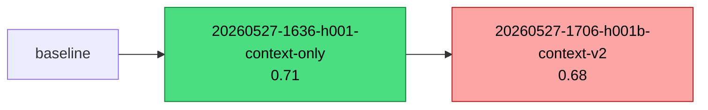

# Research Tree — climb cycle observability

> Generated by `tools/climb/regen-tree.py` at 2026-05-27 23:13:46
> Do NOT edit — re-generated on every push / LB landed.

**SOTA**: 20260527-1636-h001-context-only = 0.71 (paradigm context-only)

## Paradigm calibration matrix

| paradigm | n | mean_gap | std | last_3 |
|---|---|---|---|---|
| context-only | 2 | 0.11 | 0.01 | [0.12, 0.09] |
| baseline-enhanced | 0 | — | — | [—] |
| vap-stereo | 0 | — | — | [—] |
| ensemble | 0 | — | — | [—] |

## Push ladder (chronological)

| run_id | paradigm | parent | local | online | gap | verdict |
|---|---|---|---|---|---|---|
| 20260527-1636-h001-context-only | context-only | baseline | 0.59 | 0.71 | 0.12 | 🥇 confirmed SOTA |
| 20260527-1706-h001b-context-v2 | context-only | 20260527-1636-h001-context-only | 0.59 | 0.68 | 0.09 | 🔴 falsified -0.027 激进阈值 |

## Mermaid push DAG

## Hypothesis pool

### Active (7) — ranked by priority
- **H-002** (rank 0.85, cost 1h, pending): 修 baseline 漏分点——逐类阈值搜索（baseline 写死 0.5）
  - lift: +0.05~0.07 Macro-F1（EDA 已验证阈值调优杠杆）
- **H-003** (rank 0.65, cost 3h, pending): baseline 损失 BCE→ASL(γ+=0,γ-=2~4,m=0.05) + 适度 pos_weight（替裸 neg/pos）
  - lift: +0.01~0.03，主要拉 BC/I
- **H-005** (rank 0.60, cost 9h, pending): 双声道 cross-attention VAP 式融合，冻结 Qwen2-Audio Whisper encoder（合规优先）
  - lift: +0.05~0.10，目标破前10
- **H-004** (rank 0.55, cost 4h, pending): baseline 音频塔改保帧序列 + 双声道（不 mean-mono + tail-pool）
  - lift: +0.01~0.03，BC/I
- **H-006** (rank 0.50, cost 3h, pending): 编码器 spike——chinese-hubert-large(317M) vs Qwen2-Audio encoder 的 BC/I 增益对比
  - lift: 决定是否值得报备非 Qwen 模型
- **H-007** (rank 0.45, cost 2h, pending): 显式 F0/pitch 帧特征注入（中文 turn-taking 更依赖 pitch）
  - lift: +0.005~0.02（中文声调红利）
- **H-008** (rank 0.30, cost 2h, pending): A+B+C 多 paradigm 集成（rank 平均）+ 逐类跨折最小偏差阈值
  - lift: +0.01~0.03（冲前3最后一公里）

### Confirmed (1)
- H-001: 纯上下文标签 LGBM + 逐类阈值，做成可提交 CSV（首个公榜锚点）

### Falsified (9) — negative cache
- H-001b: context-v2 K-fold OOF + XGB 集成 + 80 特征（榨 context-only） — _falsified — 线上 0.6833 < cycle1 0.7108。激进 OOF 阈值(T 0.64)害的_
- H-A1: 廉价声学特征 late fusion（energy/zcr/voicing/双声道对比 30维）测 BC — _falsified — BC 0.217→0.219(噪声)。粗声学统计救不了 BC，未提交_
- H-T1: ASR 词汇特征 late fusion（BC词频/最近BC词距/通道短发声率）测 BC — _falsified for BC (0.217→0.201) 但意外帮 T(+0.04)/I(+0.05)。词袋抓不到BC时机。未提交(C阈值floor砍崩C)_
- H-T2: 文本特征救 T/I（保留 cycle1 的 C 低阈值，文本特征专攻 T/I）+ per-class-aware 阈值 — _不提交：vs cycle1 test 差35%，T正例502→655(v2反向风险)、I砍2/3。CV+0.004在误差内，预测剧烈偏移可疑_
- H-T3: Qwen3-0.6B 冻结 mean-pool 文本特征 → LGBM — _falsified — 稠密embedding喂LGBM错配。提取跑到29%杀掉省2.5h。110通缓存留存_
- H-N1: Qwen3 文本 embedding 喂神经融合头（线性投影+MLP，纠正喂树错配） — _falsified — 神经头也救不了。冻结Qwen3 mean-pool文本本身是噪声(BC 0.227→0.168)_
- H-V1: 最小 VAP — 双声道 mel 帧序列 + cross-attention（保序列不pool），纯音频攻 BC — _纯音频 mel BC=0.161(对比不公平,纯音频vs纯context)。首跑 nan bug(log-mel未归一化)已修_
- H-V2: ctx + VAP 音频融合（公平对比：音频对 context 有无 BC 增量） — _★干净负结果：同输入同架构，ctx+mel音频 BC=0.198 < 纯ctx 0.227。mel对BC无增量_
- H-V3: whisper-small 双声道 VAP（SSL 音频替 mel，攻 BC） — _本机不可行：whisper-small 不限线程卡死全机(load39)，限4线程25min/通(10通4h)。large-v3 45h。whisper系本机全否_
